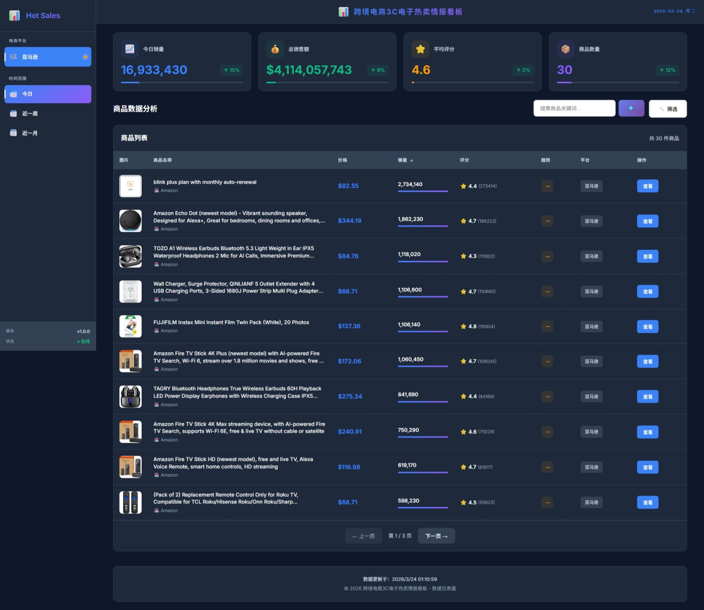

# 跨境电商3C电子热卖情报看板

## 📋 项目概述

跨境电商3C电子热卖情报看板是一个专注于亚马逊平台3C电子产品热卖数据的实时监控系统。该系统通过爬虫技术获取亚马逊平台的热卖商品数据，并提供直观的数据展示和分析功能。

### 核心功能

- 🛒 **热卖商品榜单**：实时展示亚马逊3C电子类目的热卖商品
- 📊 **数据概览**：展示销售总量、总销售额、平均评分等关键指标
- 🔍 **搜索功能**：支持按关键词搜索商品
- 📅 **时间范围**：支持查看今日、近一周、近一月的热卖数据
- 📱 **响应式设计**：适配PC、平板、手机等多种设备
- 🔄 **每日更新**：自动定时爬取数据，确保数据新鲜度

## 🛠️ 技术栈

### 前端
- **框架**：Vue 3 + Vite
- **语言**：JavaScript
- **UI**：响应式布局 + 现代CSS
- **API**：Fetch API

### 后端
- **框架**：Node.js + Express
- **数据库**：MySQL
- **爬虫**：Puppeteer + Cheerio
- **定时任务**：node-cron
- **其他**：CORS、Helmet（安全）

## 📁 项目结构

```
├── backend/             # 后端代码
│   ├── src/             # 源代码
│   │   ├── config/      # 配置文件
│   │   ├── controllers/ # 控制器
│   │   ├── models/      # 数据模型
│   │   ├── routes/      # 路由
│   │   ├── services/    # 服务层
│   │   └── app.js       # 应用入口
│   ├── package.json     # 依赖管理
│   └── .env.example     # 环境变量示例
├── src/                 # 前端代码
│   ├── api/             # API调用
│   ├── components/      # 组件
│   ├── styles/          # 样式
│   ├── App.vue          # 主应用
│   └── main.js          # 入口文件
├── index.html           # HTML模板
├── package.json         # 前端依赖
├── vite.config.js       # Vite配置
└── README.md            # 项目说明
```

## 🚀 快速开始

### 1. 环境准备

- **Node.js**：v16+  
- **MySQL**：5.7+  
- **Git**：最新版本

### 2. 安装依赖

```bash
# 前端依赖
npm install

# 后端依赖
cd backend
npm install
```

### 3. 配置环境变量

在 `backend` 目录下创建 `.env` 文件，内容如下：

```env
# 服务器配置
PORT=3006
NODE_ENV=development

# MySQL配置
MYSQL_HOST=localhost
MYSQL_PORT=3306
MYSQL_USER=root
MYSQL_PASSWORD=your_password
MYSQL_DATABASE=hot_sales

# CORS配置
CORS_ORIGIN=*
```

### 4. 启动服务

```bash
# 启动前端服务（端口3000）
npm run dev

# 启动后端服务（端口3006）
cd backend
node src/app.js
```

### 5. 访问应用

- **前端**：http://localhost:3000
- **后端API**：http://localhost:3006/api
- **健康检查**：http://localhost:3006/health

## 📊 数据说明

### 数据来源
- **亚马逊**：通过爬虫获取热卖商品数据

### 数据字段
- **标题**：商品名称
- **价格**：商品价格
- **销量**：估算销量
- **评分**：用户评分
- **评论数**：评论数量
- **店铺名**：销售店铺
- **商品链接**：跳转到亚马逊详情页
- **图片**：商品图片

### 数据更新
- **更新频率**：每日自动更新
- **更新时间**：23:59
- **数据保留**：30天

## 🔧 核心功能

### 1. 爬虫服务
- **Amazon爬虫**：获取3C电子类目热卖商品
- **反爬措施**：随机User-Agent、视窗随机化、人类行为模拟
- **错误处理**：多站点轮询、失败重试

### 2. 数据服务
- **数据存储**：MySQL数据库
- **数据清洗**：去重、格式化
- **数据查询**：支持多条件筛选

### 3. API接口
- **获取商品**：`GET /api/products?platform=amazon&timeRange=today`
- **健康检查**：`GET /api/health`

### 4. 前端功能
- **数据概览**：实时统计数据
- **商品列表**：表格展示，支持排序
- **搜索筛选**：关键词搜索、价格/评分/销量筛选
- **时间范围**：今日/近一周/近一月切换

## 📱 界面预览



### 功能展示
- **数据概览卡片**：销售总量、总销售额、平均评分、商品数量
- **商品列表**：Amazon热卖商品展示
- **搜索筛选**：关键词搜索和条件筛选
- **时间范围**：今日/近一周/近一月切换
- **响应式设计**：适配PC、平板、手机等多种设备

## 🔍 调试与开发

### 测试脚本

```bash
# 测试爬虫
node backend/test-amazon-crawler.js

# 测试API
node test-api.js

# 清空数据库
node backend/clear-database.js
```

### 日志

- **前端**：浏览器控制台
- **后端**：终端输出
- **爬虫**：详细的爬取日志

## 📝 注意事项

1. **爬虫合规**：遵守robots.txt协议，设置合理的爬取间隔
2. **数据使用**：仅用于个人学习和研究，不得用于商业用途
3. **API密钥**：请勿在代码中硬编码敏感信息
4. **性能优化**：定期清理过期数据，优化数据库索引

## 🤝 贡献

欢迎提交Issue和Pull Request！

## 📄 许可证

MIT License

## 📞 联系方式

- **项目地址**：https://github.com/C-sanjin/hotSales
- **创建时间**：2026-03-23

---

**跨境电商3C电子热卖情报看板** - 让数据驱动决策 📊